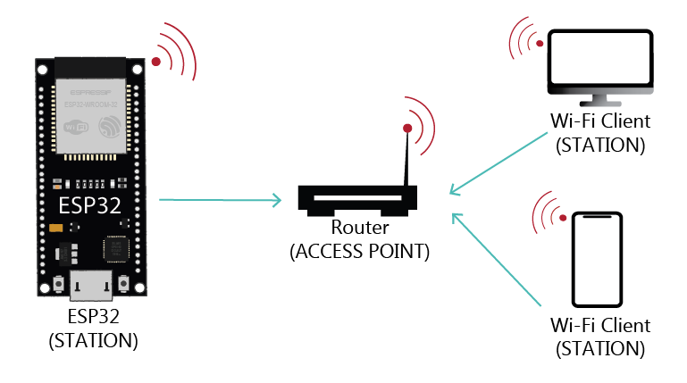

# **Esp 32 Http Server**
- Connettiamo un Esp 32 ad una wifi 
- Rendiamolo un server in grado di ricevere richieste http dai client
- Cambiamo o leggiamo lo stato di un led attraverso richieste http



***

### Capitoli nel dettaglio
1. [Componenti Necessari](#1---componenti)
2. [Collegamenti](#2---collegamenti)
3. [Come scaricare il codice](#3---come-scaricare-il-codice)
4. [Spieghiamo il Codice](#4---spieghiamo-il-codice)
5. [Link utili](#5---link-utili)


## 1 - Componenti
***

- **Esp 32**
- **Led**
- **resistenza da 220 Ohm**
- **Breadboard**
- **Cavi**


## 2 - Collegamenti
***


## 3 - Come scaricare il codice
***
Il codice può essere scaricato facilmente in due modi:
* Clonando la Repository
```
 git clone https://example.com
```

oppure

* Effettuando il Download dal Git Hub
 cliccando sul bottone **Code** poi su **"Download ZIP"**


## 4 - Spieghiamo il Codice
***


### **Struttura del progetto**
prima di iniziare a leggere qualche riga di codice, andiamo ad esplorare la struttura<br>

```
.
├── ...
├── include  
├── lib                
├── src               
│   ├── communication          # communication functions
│   │   ├── communication.cpp
│   │   └── communication.h 
│   │
│   ├── global                 # global variables/const/define   
│   │   ├── global.cpp
│   │   └── global.h 
│   │
│   └── main.cpp                # main code
│           
├── test  
├── .gitignore  
└── platformio.ini 

```


### **Riadattiamo il codice**
per far funzionare il codice sul vostro dispositivo bisogna configurare alcuni valori<br>

```
─── src/global/global.h ────

#ifndef global_h
#define global_h

extern const char* ssid;
extern const char* password;

#define LED 16  //Sostituisci con il pin dove hai connesso il tuo led

#endif
```

```
─── src/global/global.cpp ────

#include "global.h"

const char* ssid = "your_ssid";
const char* password = "your_password*";

//Sostituisci con i parametri per accedere al tuo Wi-Fi

```

### **Il  Setup**
Nella parte di Setup del codice sono andato ad inizializzare il pin del "LED" (#define presente nel file 'global.h') sulla modalità di OUTPUT;
<br>
Dopo aver impostato la velocità seriale a 9600 BAUD, ho richiamato la funzione connectToWifi(), presente nel file 'communication.cpp'
```
─── src/main.cpp ────
...

void setup() 
{
  pinMode(LED, OUTPUT);
  Serial.begin(9600);
  
  connectToWiFi(); 
}

...
```
> inizializzare la **Seriale** vuol dire che stiamo comunicando ad arduino di utilizzare la *Comunicazione Seriale*, ovvero tramite la porta USB potremmo ricevere o inviare comandi o anche semplici messaggi


### **void Loop**
- Nel loop vado a vedere ripetutamente se è presente un client che vuole fare una richiesta al nostro Esp32

- Se è connesso andiamo a leggere la richiesta Http e viene salvata in un documento json che funziona similmente agli array associativi in php oppure ai dizionari in python

- Infine vado a vedere il methodo utilizzato e l'url richiesto così da eseguire un'azione diversa a seconda di questi due valori
```
─── src/main.cpp ────
...

void loop() 
{
   WiFiClient client =  getClient();

  if(client){
    String currentLine = ""; 

    while(client.connected()){
      if(client.available()){
        char c = client.read();

        if(c == '\n'){
          if (currentLine.length() == 0) {
            serializeJson(doc, Serial); // print in serial monitor

            if(doc["method"] == "POST"  && doc["url"] == "/led"){
              digitalWrite(LED, doc["state"]);
              client.println("HTTP/1.1 200 OK");
            }
            else if(doc["method"] == "GET"  && doc["url"] == "/led"){
              client.println("HTTP/1.1 200 OK");
              client.print("state: ");
              client.println(digitalRead(LED));
            }

            client.println("Content-type: text/html");
            client.println("Connection: close");
            doc.clear();
            break;
          }else{
            parseRequestLine(currentLine, &doc);                    
            currentLine = "";
          }
        } else if (c != '\r') { 
          currentLine += c;     
        }
      }
    }

    client.stop();
    Serial.println("client disconnected");
  }
}

```


## 5 - Link utili
***
- https://randomnerdtutorials.com/esp32-useful-wi-fi-functions-arduino/#9
- https://developer.mozilla.org/en-US/docs/Web/HTTP/Messages